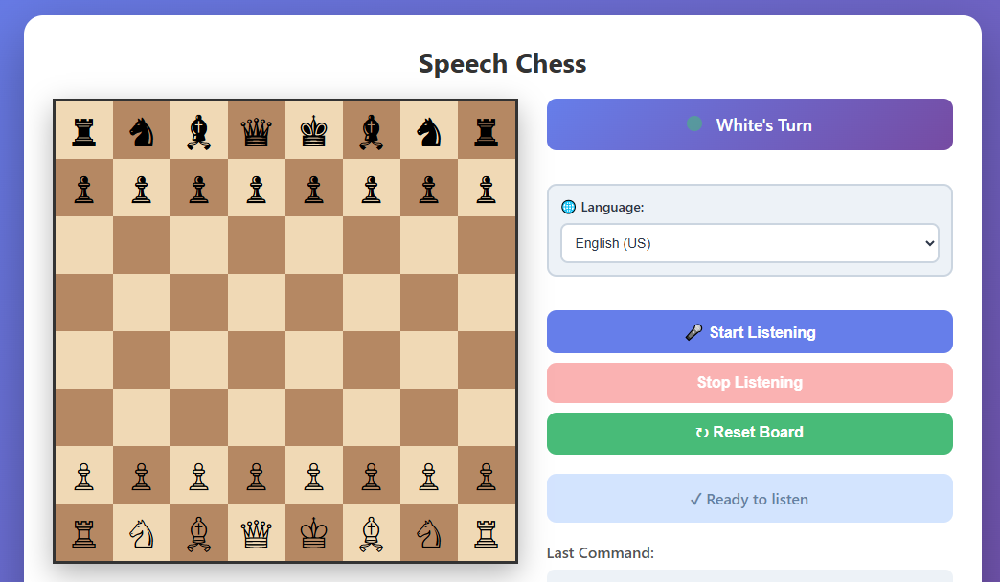

# Speech Chess

A real-time voice-controlled chess game built with Python Flask and Web Speech API. Play chess by speaking move commands!



## Features
- Real-time voice recognition for chess moves
- Web-based interface
- Automatic chess move validation

## How to Play

### Voice Command Format
Speak your moves in any of these formats:
- **"e2 e4"** - Simplest format (from-square to-square)
- **"move e2 to e4"** - Complete format
- **"pawn e2 e4"** - With piece name (piece names are optional)

The app recognizes the board coordinates (a-h for columns, 1-8 for rows) and translates them to valid chess moves.

### Example Commands
- "e2 e4" → Moves pawn from e2 to e4
- "g1 f3" → Moves knight from g1 to f3
- "e1 g1" → Castles kingside (if valid)
- "e5 e4" → Captures pawn on e4 (if valid)

## Setup Instructions

### 1. Install Python Dependencies
```bash
pip install -r requirements.txt
```

### 2. Install FFmpeg (Required for audio processing)
**Windows:**
```bash
# Using Chocolatey (if you have it)
choco install ffmpeg

# Or download from: https://ffmpeg.org/download.html
# Add to PATH after installation
```

**macOS:**
```bash
brew install ffmpeg
```

**Linux:**
```bash
sudo apt-get install ffmpeg
```

### 3. Run the Application
```bash
python app.py
```

### 4. Open in Browser
Navigate to: `http://localhost:5000`

## How to Use

1. **Allow Microphone Access** - When prompted, allow the browser to access your microphone
2. **Click "Start Listening"** - Begin recording your voice command
3. **Speak Your Move** - Say the move clearly (e.g., "e2 e4")
4. **Click "Stop Listening"** - The app will process your speech and make the move
5. **View the Result** - The board updates with your move, and the history shows what was recognized

## Controls
- **Start Listening** - Begin voice input
- **Stop Listening** - End recording and process the move
- **Reset Board** - Return to starting position and clear move history

## Board Display
- Light squares: #f0d9b5
- Dark squares: #b58863
- Pieces shown as Unicode chess symbols (♟ ♞ ♗ ♖ ♕ ♔ etc.)

## Important Notes
- You need internet connection for Google Speech Recognition API
- Speak clearly and at normal pace for best results
- The app validates all moves using python-chess library
- Move history shows the last 10 moves with what was recognized and the actual move made
- Both white (uppercase) and black (lowercase) piece moves are supported

## Troubleshooting

### Microphone Issues
- Check that your browser has permission to access the microphone
- Try refreshing the page and allowing access again
- Check System Settings → Privacy → Microphone

### Speech Recognition Issues
- Speak more clearly and at normal pace
- Check your internet connection
- Get closer to your microphone
- Try again if the app shows "Could not understand audio"

### Invalid Move Errors
- Make sure you're speaking valid squares (a1-h8)
- The move must be legal according to chess rules
- Check that you're using the correct notation (e.g., "e2" not "E2")

### FFmpeg Issues
- Make sure FFmpeg is installed and in your system PATH
- Test FFmpeg: `ffmpeg -version` in terminal
- Reinstall FFmpeg if needed

## Technical Stack
- **Backend**: Python 3.7+ with Flask 3.0
- **Speech Recognition**: Google Cloud Speech-to-Text API via SpeechRecognition library
- **Chess Engine**: python-chess 1.9.4
- **Audio Processing**: pydub with FFmpeg
- **Frontend**: HTML5, CSS3, JavaScript (Web Audio API)

## Next Steps
We can enhance this with:
- Chess move suggestions
- Difficulty levels (AI opponent)
- Game time controls
- Multiple game formats (blitz, rapid, classical)
- Move analysis and statistics
- Support for more languages
- Castling by voice
- Pawn promotion selection by voice

## System Requirements
- Python 3.7+
- Modern web browser (Chrome, Firefox, Edge, Safari)
- Microphone
- Internet connection (for speech recognition)
- FFmpeg installed and in PATH

